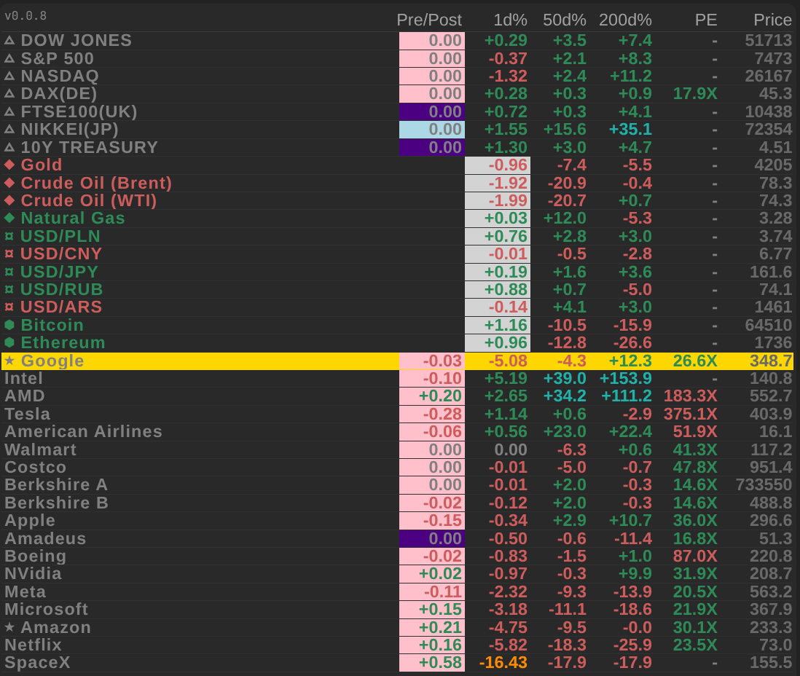

# Yahoo Finance Board Card

[](https://hacs.xyz)
[](https://github.com/marcintk/ha-yahoofinance-board-card/releases)
[](https://github.com/marcintk/ha-yahoofinance-board-card/blob/main/LICENSE)
[](https://github.com/marcintk/ha-yahoofinance-board-card)
[](https://github.com/marcintk/ha-yahoofinance-board-card/actions/workflows/build-and-test.yml)
[](https://github.com/marcintk/ha-yahoofinance-board-card)
[](https://github.com/marcintk/ha-yahoofinance-board-card/actions/workflows/build-and-test.yml)

Home Assistant custom Lovelace card displaying a compact stock market board — price, pre/post market
change, 1d/50d/200d change percentages, and a rotating data column (PE, Forward PE, Dividend Rate,
Volume). Built on top of the [yahoofinance](https://github.com/iprak/yahoofinance) integration.



## Requirements

Requires the [yahoofinance](https://github.com/iprak/yahoofinance) integration (HACS Integration) —
it provides the `sensor.yahoofinance_<symbol>` entities this card reads. See
[docs/configuration-example.yaml](docs/configuration-example.yaml) for sensor setup.

## Installation

### Via HACS (recommended)

1. In HACS → Frontend → click the three-dot menu → **Custom repositories**
   - Repository: `https://github.com/marcintk/ha-yahoofinance-board-card` (exact URL)
   - Category: **Dashboard**
2. Search **Yahoo Finance Board Card** → Install
3. Reload your browser
4. Add the card to your dashboard (see Configuration below)

### Manual

1. Download `card.js` from the
   [latest release](https://github.com/marcintk/ha-yahoofinance-board-card/releases/latest)
2. Copy it to `<config>/www/ha-yahoofinance-board-card/card.js` (create the folder if needed)
3. In Home Assistant → Settings → Dashboards → Resources → **Add resource**
   - URL: `/local/ha-yahoofinance-board-card/card.js`
   - Resource type: **JavaScript module**
4. Reload your browser

## Configuration

Add a **Manual card** to your dashboard and paste:

```yaml
type: custom:ha-yahoofinance-board-card
prefix: sensor.yahoofinance_
icons: auto
pinned:
  - symbol: dji
    name: "DOW JONES"
  - symbol: gspc
    name: "S&P 500"
  - symbol: ixic
    name: "NASDAQ"
  - symbol: gc_f
    name: "Gold"
  - symbol: usdpln_x
    name: "USD/PLN"
sorted:
  - symbol: aapl
    name: "Apple"
  - symbol: msft
    name: "Microsoft"
  - symbol: nvda
    name: "NVidia"
    mark: "gold"
  - symbol: tsla
    name: "Tesla"
    icon: "★"
```

### Card options

| Option              | Type             | Default                | Description                                                                                                                         |
| ------------------- | ---------------- | ---------------------- | ----------------------------------------------------------------------------------------------------------------------------------- |
| `prefix`            | string           | `sensor.yahoofinance_` | Entity ID prefix for Yahoo Finance entities                                                                                         |
| `pinned`            | list             | `[]`                   | Stocks rendered in configured order (indices, commodities, FX)                                                                      |
| `sorted`            | list             | `[]`                   | Stocks sorted by 1-day change descending (individual equities)                                                                      |
| `icons`             | `auto` \| `none` | `none`                 | `auto` — prefix each row with a type icon detected from the symbol slug; `none` — no icons                                          |
| `data_rotate_every` | number           | `60`                   | Seconds between data column cycles (PE → FPE → Div → Vol); `0` = disabled                                                           |
| `colors`            | map              | —                      | Per-state color overrides; see [Market states and colors](#market-states-and-colors)                                                |
| `height`            | string           | auto                   | Card height (CSS value); omit to fit content                                                                                        |
| `lazy_refresh`      | number           | `1`                    | Seconds to wait before re-rendering after a state change; resets if another event arrives during the wait; `0` = render immediately |
| `fixed_refresh`     | number           | `60`                   | Re-render every N seconds regardless of events; `0` = disabled                                                                      |
| `debug`             | boolean          | `false`                | Enables debug overlay (event/filter/render counters) and version badge (top-left)                                                   |

### Stock entry options

| Field    | Type   | Default  | Description                                                                                         |
| -------- | ------ | -------- | --------------------------------------------------------------------------------------------------- |
| `symbol` | string | required | Yahoo Finance symbol slug (lowercase, see note below)                                               |
| `name`   | string | required | Display name shown in the name column                                                               |
| `icon`   | string | —        | Icon character shown before the name; overrides `icons: auto` detection or adds an icon when `none` |
| `mark`   | string | —        | CSS color applied as the row background (e.g. `"gold"`, `"#1a1a2e"`)                                |

#### Auto icon detection (`icons: auto`)

| Symbol pattern    | Examples                                                   | Icon | Type      |
| ----------------- | ---------------------------------------------------------- | ---- | --------- |
| ends `_f`         | `gc_f`, `bz_f`, `cl_f`, `ng_f`                             | `◆`  | Commodity |
| ends `_x`         | `usdpln_x`, `usdjpy_x`                                     | `¤`  | FX pair   |
| known index list  | `dji`, `gspc`, `ixic`, `dax`, `ftse`, `n225`, `tnx`, `vix` | `△`  | Index     |
| known crypto base | `btc_usd`, `eth_usd`, `sol_usd`                            | `⬢`  | Crypto    |
| everything else   | `aapl`, `tsla`, `brk_a`                                    | —    | Equity    |

### Symbol naming

Entity IDs follow the pattern `sensor.yahoofinance_<slug>` where `<slug>` is derived from the Yahoo
Finance ticker:

| Ticker    | Slug      | Entity ID                     |
| --------- | --------- | ----------------------------- |
| `^DJI`    | `dji`     | `sensor.yahoofinance_dji`     |
| `BRK-A`   | `brk_a`   | `sensor.yahoofinance_brk_a`   |
| `GC=F`    | `gc_f`    | `sensor.yahoofinance_gc_f`    |
| `AMS.MC`  | `ams_mc`  | `sensor.yahoofinance_ams_mc`  |
| `BTC-USD` | `btc_usd` | `sensor.yahoofinance_btc_usd` |

### Columns

| Column   | Shows                                                                                     |
| -------- | ----------------------------------------------------------------------------------------- |
| Name     | Stock name; colored by 1d% during `REGULAR` session, theme secondary color otherwise      |
| Pre/Post | Pre or post market change %; background color indicates session type                      |
| 1d%      | Regular market change %; highlighted gray background during `REGULAR` session             |
| 50d%     | 50-day average change % (±30% threshold for color)                                        |
| 200d%    | 200-day average change % (±30% threshold for color)                                       |
| Data     | Cycles through PE / Forward PE / Dividend Rate / Volume every `data_rotate_every` seconds |
| Price    | Current price: pre/post/regular market depending on session                               |

### Market states and colors

The card uses one color per market state, applied as the **Price** text color, the **Pre/Post**
column background during pre/post sessions, and the **1d%** column background during regular hours.

| State      | When                       | Default                          |
| ---------- | -------------------------- | -------------------------------- |
| `UNKNOWN`  | Market closed, data static | `--secondary-text-color` (theme) |
| `REGULAR`  | Normal trading hours       | `--primary-text-color` (theme)   |
| `PREPRE`   | Pre-pre market             | lightblue                        |
| `PRE`      | Pre-market                 | khaki                            |
| `POST`     | Post-market                | palevioletred                    |
| `POSTPOST` | Post-post market           | mediumpurple                     |

Override any state via `colors:` in the card config:

```yaml
colors:
  PRE: "#d4af37"
  POSTPOST: indigo
```

## Development

See [CLAUDE.md](CLAUDE.md) for build commands, contributing guidelines, and release instructions.
